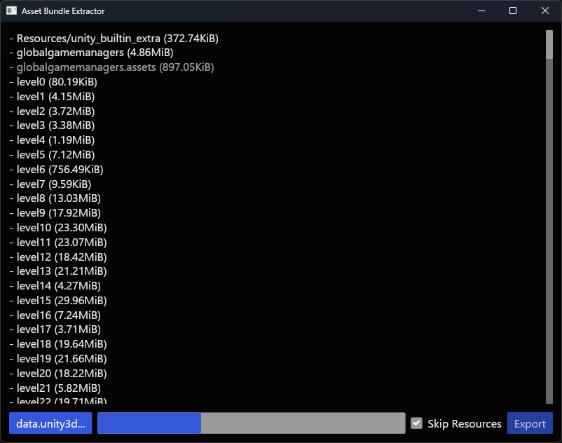

# Unity Assetbundle Extractor

Consider [UABEA](https://github.com/nesrak1/UABEA) or [AssetRipper](https://github.com/AssetRipper/AssetRipper) if you need more flexibility, the use case for this tool is specifically
- you want to extract the inner files from an `AssetBundle`
- you don't want to blow up your RAM meanwhile (this tools streams the file without keeping the entire decoded bundle im memory)

Downloads can be found in the [Releases](https://github.com/jakobhellermann/unity-asset-bundle-extractor/releases)